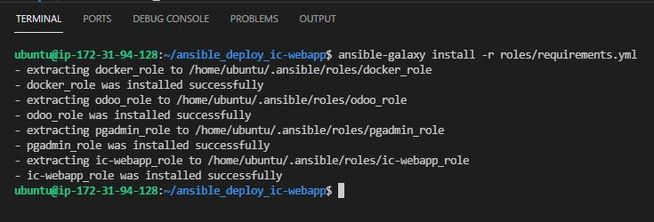
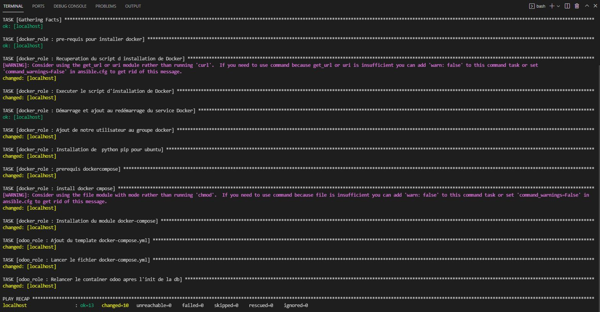
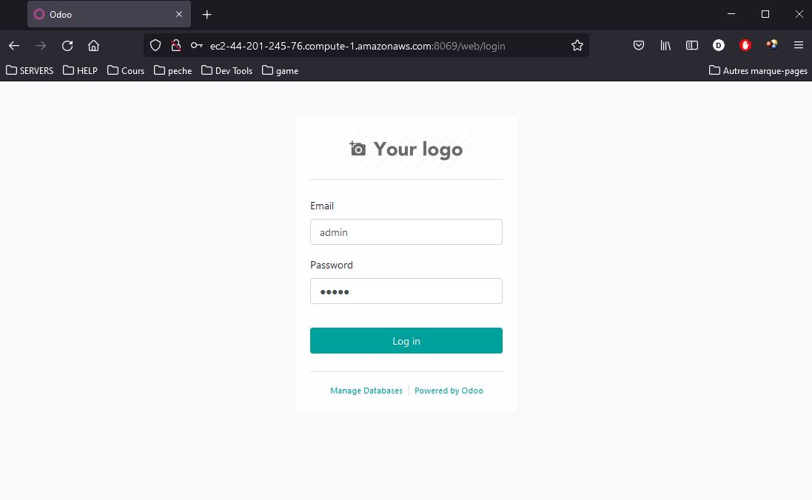
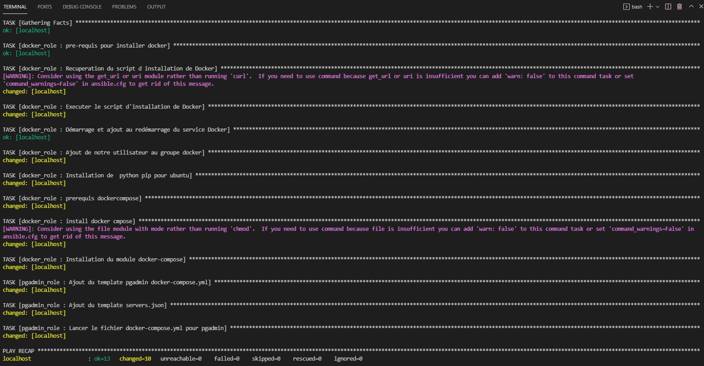
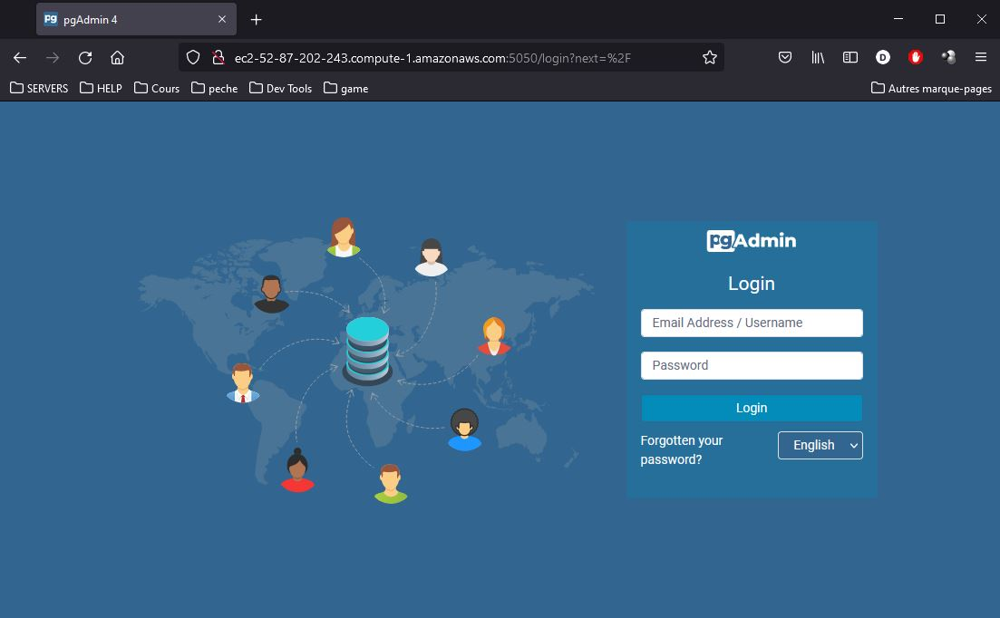
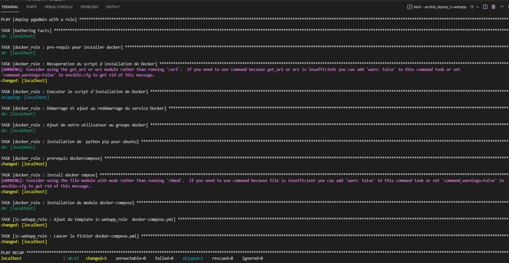
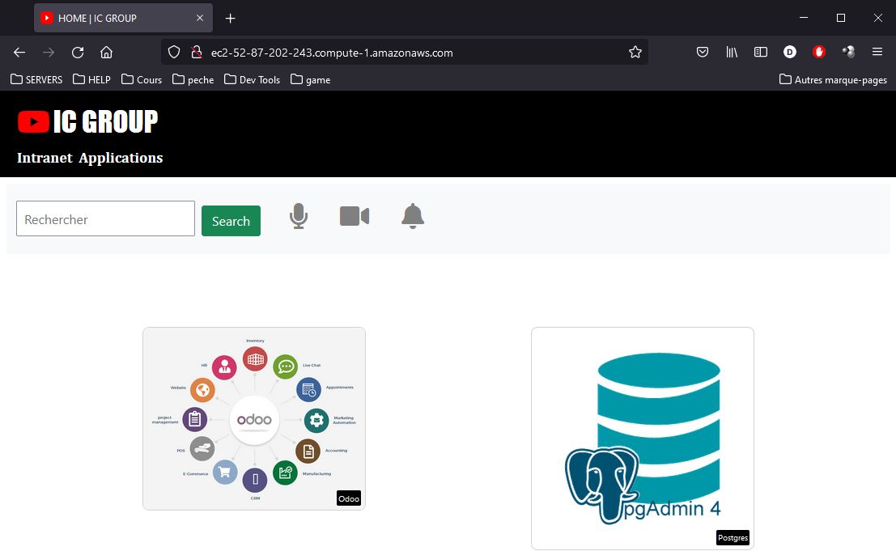

# Création des Rôles Ansible.
Le but étant de déployer des conteneurs docker, nous avons déterminé 4 roles :
* **docker_role** : qui permet d'installer tous les outils necessaire pour la création de conteneur docker et de docker-compose
* **odoo_role** : qui lancera 2 conteneurs "connectés" celui de la base de donnée postgres et celui de odoo
* **pgadmin_role** : qui lancera un conteneur pgadmin (permettant de visualiser la base de donnée postgres de odoo)
* **ic-webapp_role** : lance notre site vitrine ic-webapp.

Pour des raisons d'unicité, et à cause d'un problème rencontré avec pgadmin (voir partie Troubleshooting), nous avons choisi de déployer tous nos conteneur via docker_compose de ansible.
<br>

Pour des raisons économique et fonctionnelles nous avons décider que :
* Les machines cibles seront des serveur ubuntu 20.04 LTS (sur aws)
* La région sera la Virginie du Nord
* L'utilisateur par défaut du système sera "ubuntu"

## 1. Role Docker
source : https://github.com/lianhuahayu/docker_role.git<br>
* Installe Docker via le script officiel "get-docker.sh"
* Ajoute et lance le service docker au démarrage du serveur
* Ajoute l'utilisateur "ubuntu" au groupe docker
* Installe python3-pip 
* Installe docker-compose (via le script officiel)
* Installe docker-compose via pip (indispensable pour les commandes ansible docker_compose)

## 2. Role Odoo 
source : https://github.com/lianhuahayu/odoo_role.git<br>
* Va déployer 2 conteneurs avec le template docker-compose:
    * conteneur backend_odoo 
        * basé sur une image postres:13 
        * exposant le port 5432 
        * initialisant les variables d'environnement avec 
            * postgres_user (utilisateur de la database)
            * postgres_password (mot de passe de la database)
            * postgres_database (nom de la database)
        * persistant les données avec un volume
    * conteneur frontend_odoo
        * basé sur une image odoo:13
        * exposant le port 8069
        * initialisant les variables d'environnement avec celles de postgres
        * spécifiant aussi l'adresse ip du host de postgres
        * lancant une commande odoo permettant d'initialiser la database pour ne pas le faire manuellement
        * persistant les données avec un volume
* Les deux conteneurs seront sur un network commun
* Toutes les données sont variabilisées donc pourront être surchargée par ansible (-e )

## 3. Role PgAdmin
source : https://github.com/Yellow-carpet/pgadmin_role.git<br>
* Va déployer un conteneur pgAdmin via le template docker-compose
    * basé sur une image de dpage/pgadmin4
    * Initialiser les variables d'environnement avec :
        * pgadmin_email (email et login de l'utilisateur)
        * pgadmin_pass (mot de passe)
        * pgadmin_port (port de l'application par défaut 80)
    * Persistance du fichier /pgadmin4/servers.json permettant à l'initialisation, d'avoir déjà du contenu : celui de la base de donnée odoo
* Va copier le fichier "templatisé" servers.json sur la machine distante contenant toute les informations de la base de donnée odoo
* Toutes les données sont variabilisées donc pourront être surchargée par ansible 

## 4. Role ic-webapp
source: https://github.com/omarpiotr/ic-webapp_role<br>
* Va déployer un conteneur ic-webapp via le templace docker-compose
    * basé par défaut sur l'image "lianhuahayu/ic-webapp:1.0" variabilisée que l'on devra surcharger par la suite.
    * Initialiser les variables d'environnement avec :
        * odoo_url : l'url de notre site odoo sour la forme http://url-odoo:8069
        * pgadmin_url : l'url de notre site pgAdmin sous la forme http://url-pgadmin:5050
        * ic_webapp_port : port exposé par notre application vers l'extérieur
* Toutes les données sont variabilisées donc pourront être surchargée par ansible


## 5. Troubleshooting
Lorsque nous avont déployé pgAdmin à l'aide de docker_container, nous nous sommes rendu compte que le fichier "**`servers.json`**", bien que présent, n'est pas pris en charge par pgAdmin.<br>
Selon la documentation officielle ci-dessous, le fichier servers.json n'est lu qu'une seule et unique fois, c'est au moment du premier lancement. Etant donné que ce fichier était partagé à l'aide de la propriété volume, et suite à de nombreux divers tests manuels que nous avont effectué nous en avont conclu que docker_container:<br>
* 1- lancait d'abord le conteneur
* 2- montait les volume ensuite
De ce fait le fichier n'était pas pris en compte.<br>
Pour résoudre ce problème nous avons utilisé docker_compose.
```
/pgadmin4/servers.json

If this file is mapped, server definitions found in it will be loaded at launch time. 
This allows connection information to be pre-loaded into the instance of pgAdmin in the container. 
Note that server definitions are only loaded on first launch, i.e. when the configuration database is created, and not on subsequent launches using the same configuration database.
```

# Les Playbooks Ansible
Afin de consommer et tester nos roles, nous avons créé 3 playbooks
* playbook_odoo :
    * docker_role
    * odoo_role
* playbook_pgadmin
    * docker_role
    * pgadmin_role
* playbook_ic-webapp
    * docker_role
    * ic-webapp_role

Afin de tester nos role nous avons créer les deux instances suivantes :
* instance ec2 odoo, sur laquelle on souhaite avoir odoo (frontend + backend)
    * t2.micro
    * ip : 44.201.245.76
    * dns : ec2-44-201-245-76.compute-1.amazonaws.com
    * sécurity Group : 22 / 5432 / 8069
* instance ec2 server, sur laquelle on souhaite avoir pgAdmin et ic-webapp
    * t2.micro
    * ip : 52.87.202.243
    * dns : ec2-52-87-202-243.compute-1.amazonaws.com
    * sécurity Group : 22 / 80 / 5050 
* Nous dispons aussi d'un clé privé permettant de se connecter aux deux instances ec2 ci-dessus:
    * /home/ubuntu/.ssh/capge_projet_kp.pem


* Pour lancer les playbooks, nous devons surcharger les variables d'environnement suivantes
    * **ansible_connection** : spécifier qu'il s'agit d'une connexion ssh
    * **ansible_host** : spécifier l'adresse ip de l'instance ec2 hote sur laquelle on execute le playbook
    * **host_db** : l'adresse ip de la machine sur laquelle se trouve la base de donnée postgres
    * **odoo_url** : l'adresse dns publique ou ip publique de l'instance ec2 odoo 
    * **pgadmin_url** : l'adresse dns publique ou ip publique de l'instance ec2 server
    * **ic_webapp_image** : le nom de l'image ic-webapp sur docker-hub
    * **ic_webapp_port** *(optionnel)* : port exposé (externe) de l'application ic-webapp

## Commandes ansible à exécuter (sur une machine disposant ansible)
```bash
# install requirements
ansible-galaxy install -r roles/requirements.yml
```

```bash
# deploy odoo container on odoo ec2
ansible-playbook -i hosts.yml playbook_odoo.yml \
    -e ansible_connection='ssh' \
    -e ansible_host='44.201.245.76' \
    -e postgres_image='postgres:10' \
    -e odoo_image='odoo:13.0' \
    --private-key '/home/ubuntu/.ssh/capge_projet_kp.pem'
```
### ***`console`***
<br>
### ***`site odoo`***
<br>

```bash
# deploy pgamdin on server ec2
ansible-playbook -i hosts.yml playbook_pgadmin.yml \
    -e ansible_connection='ssh' \
    -e ansible_host='52.87.202.243' \
    -e host_db='44.201.245.76' \
    --private-key '/home/ubuntu/.ssh/capge_projet_kp.pem'
```
### ***`console`***
<br>
### ***`site pgamdin`***
<br>
```bash
# deploy ic-webapp on server ec2
ansible-playbook -i hosts.yml playbook_ic-webapp.yml \
    -e ansible_connection='ssh' \
    -e ansible_host='52.87.202.243' \
    -e odoo_url='http://ec2-44-201-245-76.compute-1.amazonaws.com:8069' \
    -e pgadmin_url='http://ec2-52-87-202-243.compute-1.amazonaws.com:5050' \
    -e ic_webapp_image='lianhuahayu/ic-webapp:1.0' \
    -e ic_webapp_port='80' \
    --private-key '/home/ubuntu/.ssh/capge_projet_kp.pem'
```
### ***`console`***
<br>
### ***`site ic-webapp`***
<br>
